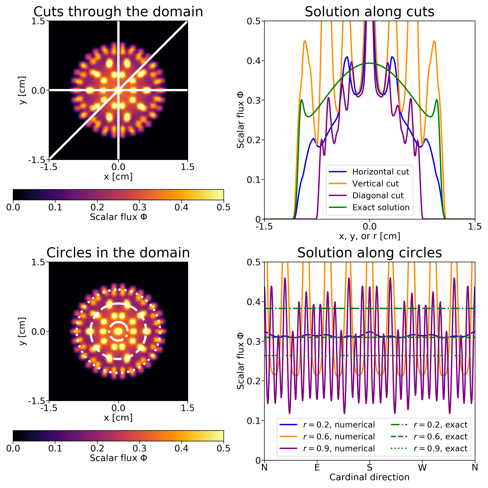
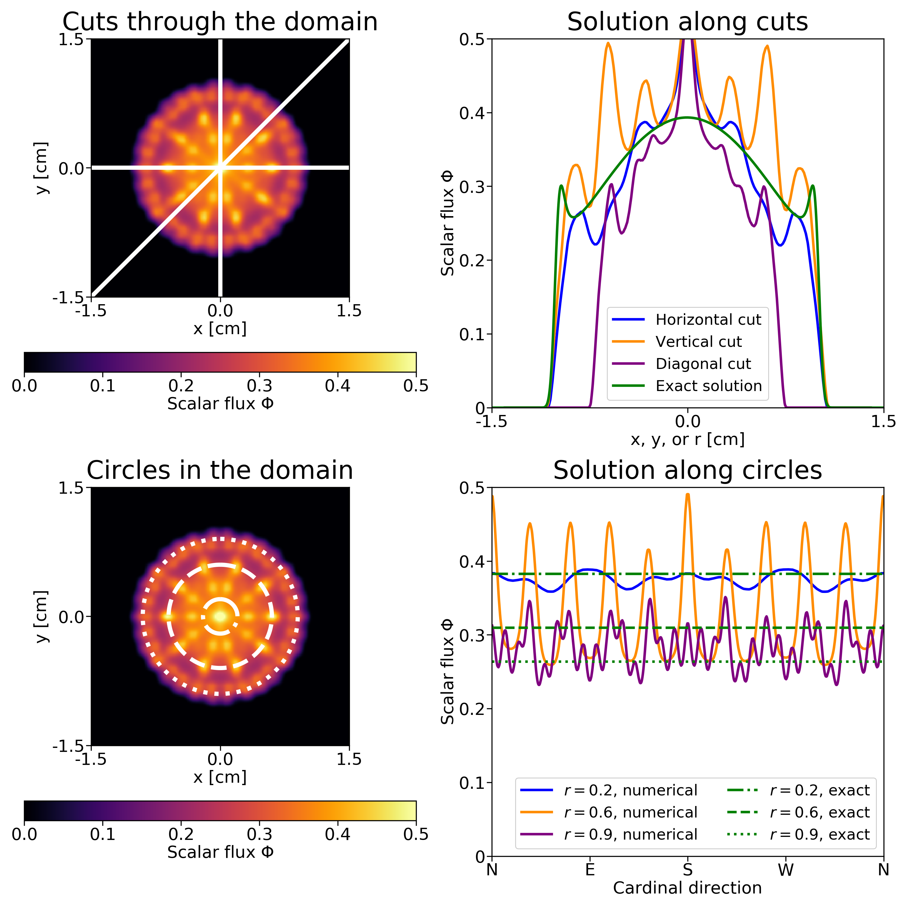

# SN code by Thomas Camminady, Martin Frank, Cory Hauck, Jonas Kusch, and Kerstin Kuepper #


## About

We implement the `rSN` and `asSN` methods. These are modifications of the standard `SN` method that mitigate ray-effects by (i) rotation of the quadrature step after each time step, or (ii) adding artificial angular diffusion via scattering.

An interpolation procedure is required which furthermore requires different (non-tensorized) quadrature sets. All these aspects are implemented in this code with `Julia`. 

## The effect of artificial scattering
### Standard SN (for the line-source problem)


### asSN with the same number of ordinates (for the line-source problem)



## Installation

The code was tested with Julia v0.7.0 and v1.0.0.

1. Clone the repository into a local folder

2. Change to the src/ directory, `cd rSN/code/src/`

3. Start the Julia REPL

4. *Optional:* You might have to add the current directory to your path:  `push!(LOAD_PATH,pwd());`

5. *Optional:* You might have to add needed packages

   v0.7:

   ```
   Pkg.add("ProgressMeter")
   Pkg.add("DelimitedFiles")
   Pkg.add("LinearAlgebra")
   Pkg.add("Dates")
   Pkg.add("PyPlot")
   Pkg.add("Revise")
   Pkg.add("FastGaussQuadrature")
   ```

   v1.0: Inside the REPL type `]` which changes the command line to `(v1.0) pkg>`. Then type

   ```
   add ProgressMeter
   add DelimitedFiles
   add LinearAlgebra
   add Dates
   add PyPlot
   add Revise
   add FastGaussQuadrature
   ```


## Running the code

There are two modes. You can run a single test case or predefine multiple test cases and let them be executed one after another. The results will always be stored in `../out/CURRENTTIMESTAMP` where `CURRENTTIMESTAMP` looks like `2018-08-17T09:24:12.74`. We store information about the problem (source, initial conditions, scattering and absorption coefficients) as well as the final density and plots that summarize the test case and the result. The purpose of these plots is not to evaluate the solution accurately but to immediately have an overview over the given content of the folder.

##### Running one test case

This will execute the test case stored in `config.txt`.

1. `using KineticSolverModule`
2. `KS = KineticSolver("config.txt");`
3. `solve!(KS)`

##### Running multiple test cases

We can specify multiple parameters in `main.jl`. The content of `config.txt` will be ignored as we are going to generate the corresponding test cases on the fly. For example: If `NX=[50,100]`and `ORDER=[10,20]` the four test cases `nx=50, order=10`, `nx=50, order=20`, `nx=100, order=10` and `nx=100, order=20` will be executed.

1. `include("main.jl");`
2. `main();`


## Modifying the code 

Inside the function `methods.jl`, different modifications of the `SN` method are implemented. This includes the `rSN` approach as well as a convolution approach. `methods` will be executed at the end of each time loop and can modify the angular flux `phi` as well as all information about the quadrature set.


